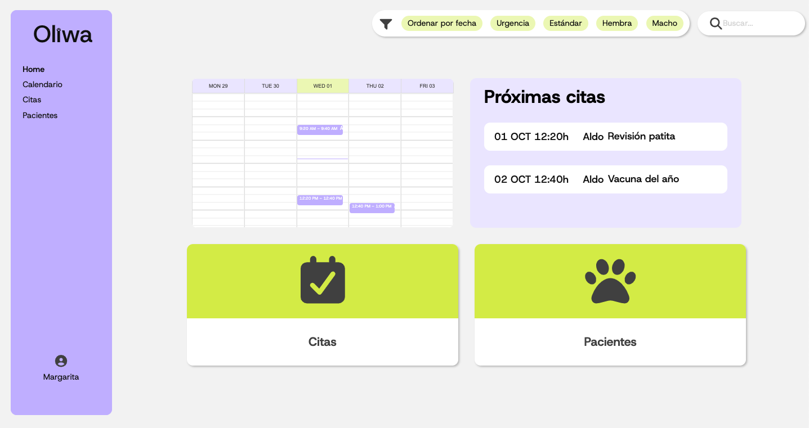
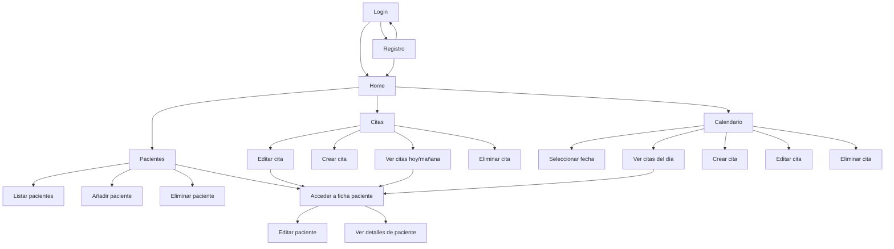
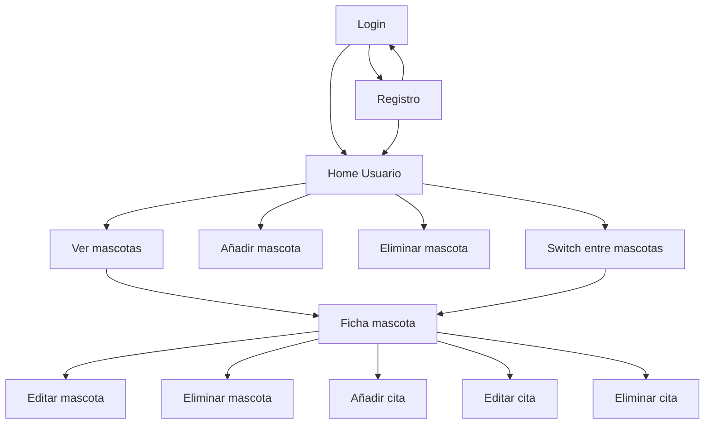

# Oliwa Frontend 🐶🐱


Aplicación frontend del sistema de gestión de pacientes de la clínica veterinaria **Oliwa**.  
Este módulo permite a administradores y clientes interactuar con la aplicación: gestionar pacientes, programar citas y consultar información de manera sencilla.

## User flows
### Admin flow


### User flow


## 🛠️ Tecnologías

- React
- CSS Modules
- Fetch API para consumir el backend
- React Router para navegación

## 📦 Requisitos previos

```
- Node.js >= 22.15
- npm >= 10.9.2
- Acceso al backend del proyecto (repositorio [aquí](https://github.com/clinica-veterinaria/ex-java-springboot-veterinary_clinic-back))
```

## 🚀 Instalación y ejecución

1. Clonar el repositorio:
   ```
   git clone https://github.com/clinica-veterinaria/ex-java-springboot-veterinary_clinic-front.git
    ```

2. Entrar en la carpeta del clone

3. Instalar dependencias:

   [Aquí tienes una guía con instalaciones](https://www.notion.so/sara-vazquez/FRONTEND-1fcd5565c5b680c9b26aef8c60181630)
    ```
    npm install
    ````

5. Levantar el servidor
    ```
    npm run dev
    ```

6. Abrir en el navegador
    ```
    http://localhost:5173
    ```


## 📋 Funcionalidades principales

- Gestión de pacientes:
  - Listar, añadir, modificar y eliminar (solo admin).
  - Visualizar datos de un paciente desde su número de identificación o DNI del tutor.
  - Adjuntar imagen de perfil del paciente.

- Gestión de citas:
  - Listar, añadir, modificar y eliminar.
  - Restricciones:
    - Máximo 10 citas por día.
    - Cambio automático a estado *pasada* si no se atiende.
    - Eliminación automática de citas pasadas cada 3 meses.
  - Notificación por correo al programar, modificar o eliminar la cita.

## 🧪 Cobertura de tests


## 🌲 File tree 
```
.
├── coverage
│   ├── lcov-report
│   │   ├── components
│   │   ├── pages
│   │   ├── services
│   │   ├── base.css
│   │   ├── prettify.css
│   │   ├── HomePage.jsx.html
│   │   ├── HomeUserPage.jsx.html
│   │   ├── index.html
│   │   ├── LoginPage.jsx.html
│   │   ├── block-navigation.js
│   │   ├── prettify.js
│   │   ├── sorter.js
│   │   ├── favicon.png
│   │   └── sort-arrow-sprite.png
│   ├── lcov.info
│   ├── coverage-final.json
│   └── clover.xml
├── public
│   └── vite.svg
├── src
│   ├── assets
│   │   ├── favicon.ico
│   │   ├── homepage.png
│   │   ├── logoNegative.svg
│   │   ├── logoPositive.svg
│   │   └── react.svg
│   ├── components
│   │   ├── addAppt
│   │   ├── addSelectModal
│   │   ├── addTreatment
│   │   ├── alphabetIndex
│   │   ├── appointmentCard
│   │   ├── appointmentDetailsAdmin
│   │   ├── appointmentDetailsUser
│   │   ├── appointmentsWidget
│   │   ├── buttonAdd
│   │   ├── buttonProfile
│   │   ├── buttons
│   │   ├── buttonStatus
│   │   ├── buttonText
│   │   ├── buttonType
│   │   ├── calendarMonth
│   │   ├── cardPatient
│   │   ├── cardsHome
│   │   ├── dateTimePicker
│   │   ├── deleteModal
│   │   ├── editAppt
│   │   ├── editDeleteModal
│   │   ├── editPatient
│   │   ├── editProfile
│   │   ├── feedbackModal
│   │   ├── filterGroup
│   │   ├── filterPills
│   │   ├── inputField
│   │   ├── mainLayout
│   │   ├── navbar
│   │   ├── nextAppointment
│   │   ├── patientRecord
│   │   ├── patientWidget
│   │   ├── petModal
│   │   ├── pillDateTime
│   │   ├── searchInput
│   │   ├── sideMenuAdmin
│   │   ├── sideMenuProfile
│   │   ├── signInModal
│   │   ├── signoutEditModal
│   │   ├── smallCalendarWidget
│   │   ├── styles
│   │   └── userLayout
│   ├── context
│   │   └── SearchContext.jsx
│   ├── pages
│   │   ├── AppointmentsPage.css
│   │   ├── CalendarPage.css
│   │   ├── HomePage.css
│   │   ├── HomeProfilePage.css
│   │   ├── HomeUserPage.css
│   │   ├── LoginPage.css
│   │   ├── PatientPage.css
│   │   ├── PatientProfile.css
│   │   ├── SignInPage.css
│   │   ├── AppointmentsPage.jsx
│   │   ├── AuthHandler.jsx
│   │   ├── CalendarPage.jsx
│   │   ├── HomePage.jsx
│   │   ├── HomeProfilePage.jsx
│   │   ├── HomeUserPage.jsx
│   │   ├── LoginPage.jsx
│   │   ├── PatientPage.jsx
│   │   ├── PatientProfile.jsx
│   │   └── SignInPage.jsx
│   ├── services
│   │   ├── APIAppointment.js
│   │   ├── APILogin.js
│   │   ├── APIPatient.js
│   │   ├── APIRegister.js
│   │   ├── APITreatment.js
│   │   └── APIUser.js
│   ├── __tests__
│   │   ├── services
│   │   ├── HomePage.test.jsx
│   │   ├── HomeUserPage.test.jsx
│   │   └── LoginPage.test.jsx
│   ├── App.css
│   ├── index.css
│   ├── setupTests.js
│   ├── App.jsx
│   └── main.jsx
├── __mocks__
│   ├── fileMock.js
│   └── styleMock.js
├── index.html
├── babel.config.js
├── eslint.config.js
├── jest.setup.js
├── vite.config.js
├── package-lock.json
├── package.json
├── README.md

```
