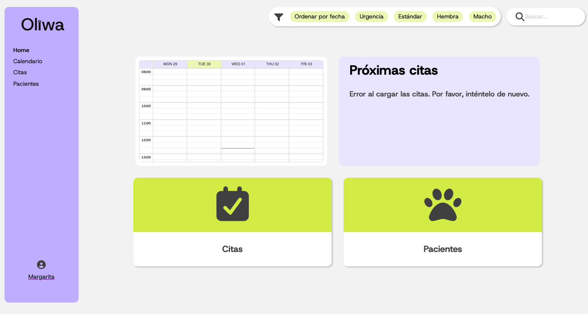
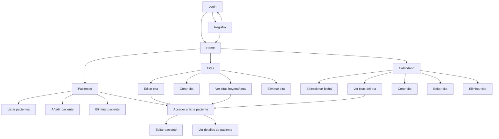
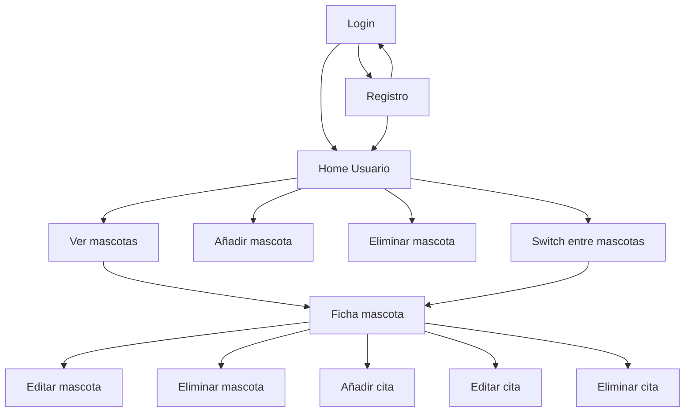

# Oliwa Frontend 🐶🐱


Aplicación frontend del sistema de gestión de pacientes de la clínica veterinaria **Oliwa**.  
Este módulo permite a administradores y clientes interactuar con la aplicación: gestionar pacientes, programar citas y consultar información de manera sencilla.

## User flows
### Admin flow


### User flow


## 🛠️ Tecnologías

- React
- CSS Modules
- Fetch API para consumir el backend
- React Router para navegación

## 📦 Requisitos previos

```
- Node.js >= 22.15
- npm >= 10.9.2
- Acceso al backend del proyecto (repositorio [aquí](https://github.com/clinica-veterinaria/ex-java-springboot-veterinary_clinic-back))
```

## 🚀 Instalación y ejecución

1. Clonar el repositorio:
   ```
   git clone https://github.com/clinica-veterinaria/ex-java-springboot-veterinary_clinic-front.git
    ```

2. Entrar en la carpeta del clone

3. Instalar dependencias:
    ```
    npm install
    ````

4. Levantar el servidor
    ```
    npm run dev
    ```

5. Abrir en el navegador
    ```
    http://localhost:5173
    ```


## 📋 Funcionalidades principales

- Gestión de pacientes:
  - Listar, añadir, modificar y eliminar (solo admin).
  - Visualizar datos de un paciente desde su número de identificación o DNI del tutor.
  - Adjuntar imagen de perfil del paciente.

- Gestión de citas:
  - Listar, añadir, modificar y eliminar.
  - Restricciones:
    - Máximo 10 citas por día.
    - Cambio automático a estado *pasada* si no se atiende.
    - Eliminación automática de citas pasadas cada 3 meses.
  - Notificación por correo al programar, modificar o eliminar la cita.

## 🧪 Cobertura de tests


